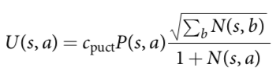

# c_puct

During Monte-Carlo Tree Search (MCTS) simulation, the algorithm evaluates potential next moves based on both their expected game result, and how much it has already explored them. A constant c is used to control this trade-off.

Standard MCTS uses a variant of the [**Upper Confidence Bound-1 (UCB-1)**](https://jeremykun.com/2013/10/28/optimism-in-the-face-of-uncertainty-the-ucb1-algorithm/) formula called [**UCT (UCB for trees)**](https://en.wikipedia.org/wiki/Monte_Carlo_tree_search#Exploration_and_exploitation). AlphaZero uses a version called polynomial upper confidence trees (PUCT). If we are at state **s** and considering action **a**, we need three values to calculate PUCT(s, a):

- **Q** — The mean action value. This is the average game result across current simulations that took action **a**.

- **P** — The prior probabilities as fetched from the network.

- **N** — The visit count, or number of times we’ve taken this action during current simulations.

We calculate **PUCT(s, a) = Q(s, a) + U(s, a)**, where **U** is calculated as follows:

### Predictor + Upper Confidence bounds for Trees (PUCT)

**Q(s, a)** Exploitation

**U(s, a)** Exploration or Upper Confidence Bound

